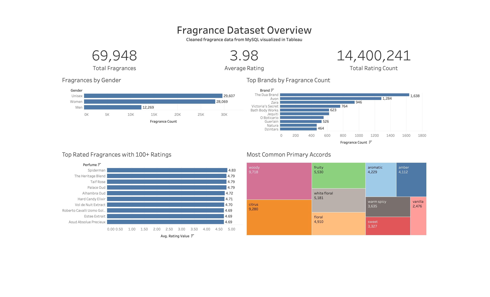

# Fragrance Dataset Overview Dashboard

**SQL Data Cleaning + Tableau Visualization Project**

Cleaned fragrance data from MySQL visualized in Tableau

---

## 1. Project Overview

This project analyzes a raw fragrance dataset using MySQL for data cleaning, deduplication, transformation, and quality testing. The cleaned dataset was then visualized in Tableau to create a dashboard summarizing fragrance trends by gender, brand, rating, and fragrance accords.

The main objective was to turn messy raw fragrance data into a cleaned, validated dataset that could be used for dashboard analysis. The final Tableau dashboard, **Fragrance Dataset Overview**, provides a high-level overview of the dataset and highlights major fragrance trends.



- **Dataset source:** Sample included in `assets/datasets/`; full raw dataset excluded due to GitHub file size limits
- **Tableau Public:** Not published yet
- **GitHub repository:** Current repository

---

## Project Links

- [User Requirements Document PDF](assets/docs/user_requirements_document.pdf)
- [User Requirements Document DOCX](assets/docs/user_requirements_document.docx)
- [Sample Raw Dataset](assets/datasets/raw_fragrance_dataset_sample.csv)
- [Dataset Note](assets/datasets/dataset_note.md)
- [SQL Files](assets/sql/)
- [Project Screenshots](assets/images/)

---

## 2. Business/Data Questions

This project was designed to answer the following questions:

- How are fragrances distributed across gender categories (Men, Women, Unisex)?
- Which brands have the largest number of fragrances in the dataset?
- Which fragrances are the highest rated when filtered to a meaningful number of ratings (100+)?
- What are the most common primary fragrance accords?
- How large and reliable is the dataset after cleaning and deduplication?

---

## 3. Tools Used

- **MySQL** – data cleaning, deduplication, transformation, and validation
- **Tableau** – dashboard creation and visualization
- **GitHub** – project documentation and version control
- **CSV / raw dataset** – original data source

---

## 4. Dataset Description

The raw dataset contained fragrance records with the following fields:

- URL
- Name
- Gender
- Rating Value
- Rating Count
- Main Accords

The raw data required significant cleaning before it could be analyzed:

- Perfume names could be extracted from URLs
- Brand names could be extracted from URLs
- Gender values needed to be standardized
- Rating values needed to be converted into numeric decimal values
- Rating counts needed to be converted into numeric whole numbers
- Main accords were stored as list-like text (e.g., `['citrus', 'musky', 'woody', ...]`) and needed to be cleaned and split into separate columns
- Duplicate records needed to be removed using normalized URLs

> Note: The full raw dataset is not included in this repository because it exceeds GitHub's file size limit. A smaller sample file, `raw_fragrance_dataset_sample.csv`, is included in `assets/datasets/` for preview purposes. The SQL cleaning process was performed locally on the full dataset, and the final cleaned view contained 69,948 fragrance records.

---

## 5. Data Cleaning Process

All cleaning was performed in MySQL. The full SQL is available in the `assets/sql/` folder; the process is summarized below.

**Main SQL objects:**

- `fra_perfumes_raw` – raw imported table
- `fra_perfumes_raw_deduped` – deduplicated table
- `vw_fragrances_cleaned` – cleaned SQL view used for analysis and the dashboard

**Deduplication (`fra_perfumes_raw_deduped`):**

1. Grouped records by `TRIM(LOWER(url))` so that each duplicate group represented the same fragrance record under a normalized URL.
2. Used `MIN(url)` to keep one URL per duplicate group.
3. Used `MAX()` on Name, Gender, Rating Value, Rating Count, and Main Accords to select one representative non-null value from each duplicate group when available.

**Cleaning and transformation (`vw_fragrances_cleaned`):**

4. Extracted perfume names from the last section of the URL, using the raw Name field as a fallback when the URL-derived name was missing or blank.
5. Extracted brand names from the URL section after `/perfume/`.
6. Standardized gender into three values: Men, Women, and Unisex.
7. Converted rating values into decimal numbers.
8. Converted rating counts into unsigned integers.
9. Cleaned the Main Accords field by removing brackets and apostrophes.
10. Split the cleaned accords into separate columns: Main Accord 1 through Main Accord 5.

See `assets/sql/03_create_cleaned_view.sql` for the full transformation logic.

---

## 6. Data Quality Checks

Before building the dashboard, a set of SQL validation checks was run against the cleaned view (see `assets/sql/04_quality_checks.sql`). Each check is documented with a screenshot in the `assets/images/` folder.

| Check | Rule | Result |
|---|---|---|
| Row count check | Confirms the total row count of the cleaned view | 69,948 rows |
| Duplicate URL check | Should return 0 rows after deduplication | Passed (0 duplicates) |
| Missing cleaned perfume name check | Cleaned names should not become missing if raw data had usable values | Passed (0 rows) |
| Missing cleaned brand check | Cleaned brands should not become missing if raw data had usable values | Passed (0 rows) |
| Missing cleaned accords check | Cleaned accords should not become missing if raw data had usable values | Passed (0 rows) |
| Invalid gender value check | Gender must only be Men, Women, or Unisex | Passed (0 invalid values) |
| Invalid rating value check | Rating Value must be between 0 and 5 | Passed (0 invalid values) |
| Invalid rating count check | Rating Count cannot be negative | Passed (0 invalid values) |

All checks passed, confirming the cleaned dataset was ready for visualization.

---

## 7. Dashboard Overview

**Title:** Fragrance Dataset Overview
**Subtitle:** Cleaned fragrance data from MySQL visualized in Tableau

**KPIs:**

- **Total Fragrances:** 69,948
- **Average Rating:** 3.98 — calculated from fragrances with valid numeric rating values; null or invalid rating values were converted to NULL during cleaning and excluded from the average
- **Total Rating Count:** 14,400,241

**Visualizations:**

- Fragrances by Gender (bar chart)
- Top Brands by Fragrance Count (bar chart)
- Top Rated Fragrances with 100+ Ratings (bar chart)
- Most Common Primary Accords (treemap)

---

## 8. Key Results

**Fragrances by Gender**

| Gender | Fragrance Count |
|---|---|
| Unisex | 29,607 |
| Women | 28,069 |
| Men | 12,269 |

> Note: The gender breakdown totals 69,945, while the dataset contains 69,948 fragrances. The remaining 3 records had null or unclassified gender values after cleaning, since the gender standardization rule only assigns records to Men, Women, or Unisex when the raw gender value maps clearly to one of those categories.

**Top Brands by Fragrance Count**

| Brand | Fragrance Count |
|---|---|
| The Dua Brand | 1,638 |
| Avon | 1,284 |
| Zara | 946 |
| Victoria's Secret | 764 |
| Bath & Body Works | 623 |
| Jequiti | 621 |
| O Boticario | 551 |
| Guerlain | 526 |
| Natura | 466 |
| Dzintars | 464 |

**Top Rated Fragrances with 100+ Ratings**

| Fragrance | Avg. Rating |
|---|---|
| Spiderman | 4.83 |
| The Heritage Blend | 4.79 |
| Taif Rose | 4.79 |
| Palace Oud | 4.79 |
| Alhambra Oud | 4.72 |
| Hard Candy Elixir | 4.71 |
| Vol de Nuit Extract | 4.70 |
| Roberto Cavalli Uomo Gold | 4.69 |
| Estee Extrait | 4.69 |
| Aoud Absolue Precieux | 4.69 |

**Most Common Primary Accords**

| Accord | Count |
|---|---|
| Woody | 9,718 |
| Citrus | 9,280 |
| Fruity | 5,530 |
| White Floral | 5,181 |
| Floral | 4,910 |
| Aromatic | 4,229 |
| Amber | 4,112 |
| Warm Spicy | 3,635 |
| Sweet | 3,327 |
| Vanilla | 2,476 |

---

## 9. Insights

- **Unisex fragrances make up the largest gender category** in the cleaned dataset, with women's fragrances close behind. Men's fragrances appear much less frequently than unisex and women's fragrances.
- **The Dua Brand, Avon, and Zara have the highest fragrance counts in this dataset**, showing which brands are most represented by number of records.
- **Woody and citrus are the most common primary accords**, each appearing as the leading accord in over 9,000 fragrances.
- **The top-rated fragrance chart was filtered to fragrances with 100+ ratings** to avoid showing fragrances with high ratings but very few reviews, making the rankings more reliable.

> Note: These results reflect the cleaned dataset used in this project and may not represent the entire global fragrance market.

---

## 10. Project Evidence / Screenshots

The `assets/images/` folder documents each stage of the project so the work can be verified without re-running the SQL:

- `raw_data_preview_part_1.png` and `raw_data_preview_part_2.png` – original raw table before cleaning
- `deduped_table_preview.png` – deduplicated table
- `cleaned_view_preview_part_1.png`, `cleaned_view_preview_part_2.png`, and `cleaned_view_preview_part_3.png` – cleaned SQL view used for Tableau
- `row_count_check.png` – confirms the cleaned row count
- `duplicate_url_check.png` – confirms duplicate URLs were removed
- `missing_names_check.png` – validates cleaned perfume names
- `missing_brands_check.png` – validates cleaned brands
- `missing_accords_check.png` – validates cleaned accords
- `invalid_gender_check.png` – validates standardized gender values
- `invalid_rating_value_check.png` – validates rating values are between 0 and 5
- `invalid_rating_count_check.png` – validates rating counts are not negative

---

## 11. Project Files

```
fragrance_data_analysis/
│
├── README.md
├── index.md
├── _config.yml
│
├── assets/
│   ├── datasets/
│   │   ├── raw_fragrance_dataset_sample.csv
│   │   └── dataset_note.md
│   │
│   ├── docs/
│   │   ├── user_requirements_document.docx
│   │   └── user_requirements_document.pdf
│   │
│   ├── images/
│   │   ├── tableau_final_dashboard.png
│   │   ├── raw_data_preview_part_1.png
│   │   ├── raw_data_preview_part_2.png
│   │   ├── deduped_table_preview.png
│   │   ├── cleaned_view_preview_part_1.png
│   │   ├── cleaned_view_preview_part_2.png
│   │   ├── cleaned_view_preview_part_3.png
│   │   ├── row_count_check.png
│   │   ├── duplicate_url_check.png
│   │   ├── missing_names_check.png
│   │   ├── missing_brands_check.png
│   │   ├── missing_accords_check.png
│   │   ├── invalid_gender_check.png
│   │   ├── invalid_rating_value_check.png
│   │   └── invalid_rating_count_check.png
│   │
│   └── sql/
│       ├── 01_create_raw_table.sql
│       ├── 02_import_data.sql
│       ├── 03_create_cleaned_view.sql
│       └── 04_quality_checks.sql
```

> The full raw dataset (`raw_fragrance_dataset.csv`) is not included in the repository due to GitHub file size limits. Only a sample is provided in `assets/datasets/`.

---

## 12. How to Reproduce

1. Review the sample raw dataset in `assets/datasets/` to understand the raw data structure.
2. Note that the sample CSV is included only to show the raw data structure — it will not reproduce the exact final dashboard numbers.
3. To reproduce the exact final dashboard numbers, the full raw dataset is needed.
4. The full raw dataset was processed locally in MySQL because it was too large for GitHub.
5. Run the SQL files in `assets/sql/` in order: create the raw table, import the data, create the cleaned view (`vw_fragrances_cleaned`), and run the quality checks.
6. Connect Tableau to the cleaned view (or an exported cleaned dataset).
7. Build the dashboard visuals: KPIs, gender bar chart, top brands chart, top rated fragrances chart, and the primary accords treemap.

> The sample CSV is included to show the structure of the raw data. Reproducing the exact dashboard totals requires the full raw dataset, which was processed locally because it was too large for GitHub.

---

## 13. Business/Portfolio Value

This project demonstrates an end-to-end analytics workflow, including:

- SQL data cleaning and transformation
- Deduplication of messy real-world records
- Data validation with repeatable quality checks
- Dashboard design and KPI selection
- Data storytelling and communicating insights visually
- Preparing messy raw data so it can be trusted for analysis

These are the same steps required in a real business setting when raw operational or scraped data needs to be converted into a reliable reporting layer.

---

## 14. Future Improvements

- Add additional accord columns (beyond Main Accord 1–5) or model accords in a normalized long format for deeper analysis.
- Analyze the relationship between rating value, rating count, and gender category.
- Add brand-level average ratings to compare brand quality, not just volume.
- Automate the cleaning pipeline with stored procedures or a scheduled ETL job.
- Publish the dashboard to Tableau Public and add interactive filters (brand, gender, accord).
